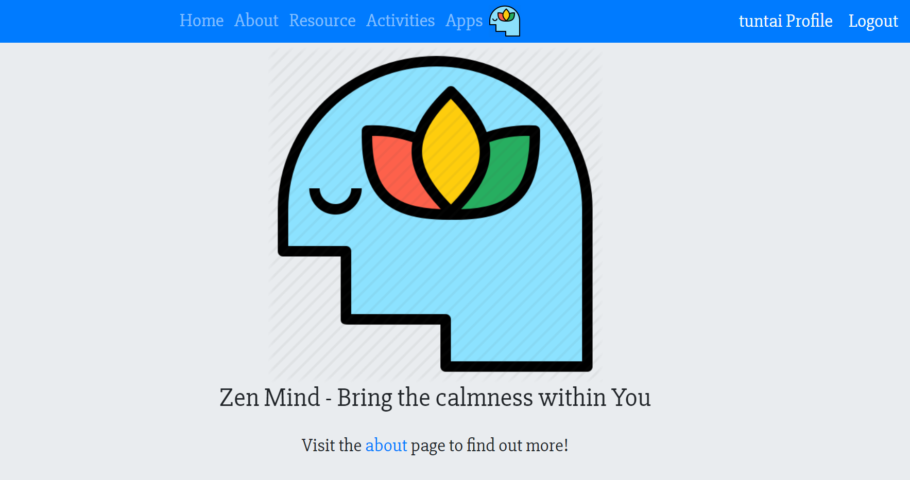

# Zen-Mind
Zen-Mind is made to support everyone who experience anxiety due to academic, social, financial, and career pressure. <br>

**:1st_place_medal: Winner at ApScript organized by IEEE Apsit SB! :partying_face:** <br>

<hr>

## Features :sparkles:
The Web-App has information on mental wellness and resources, recommended activities to soothe your mind, and provides with interactive tools aimed at helping individuals to get out of a bad cycle of anxiety. <br>
The tools include: 

 - :memo: A **Priority list** that allows individuals to arrange their tasks and focus on a things that are important, so they won’t be overwhelmed. This takes a proactive step towards facing issues of anxiety head-on, rather than procrastinating, which is known to cause further anxiety. <br>
 - :four_leaf_clover: A **Meditation tool** with soothing music for those who just need a breather and to regain their presence.

## Technologies Used :hammer_and_wrench:
 - :construction: Back-End: Django, Sqlite3 Database
 - :computer: Front-End: Bootstrap, Html5, Css3, JavaScript, jquery
 
## <a href="https://zen-mind-django-app.herokuapp.com/" target="_blank">:sunflower: Give it a try!!</a>

#### For testing you can create our own profile or use the following credentials :closed_lock_with_key:
:robot: username: tuntai <br>
:key: password: Testpass123

<hr> 

## ScreenShots :camera_flash:
  

## To run this web-app in your local systems :open_file_folder:

### 1. Pre-requisites:
1. Python 3
2. pip 3
### 2. Clone this Repo :
```sh
git clone https://github.com/Tuntai/Zen-Mind.git
cd Zen-Mind
```
You can also download the folder and extract all the files in your local system.<br>
Open your IDE install the requirements.
### 2. Install Requirements :
```sh
pip install -r requirements.txt
```
### 3. Apply migrations : 
```sh
python manage.py makemigrations
python manage.py migrate
```
### 4. Run server:
```sh
python manage.py runserver
```
